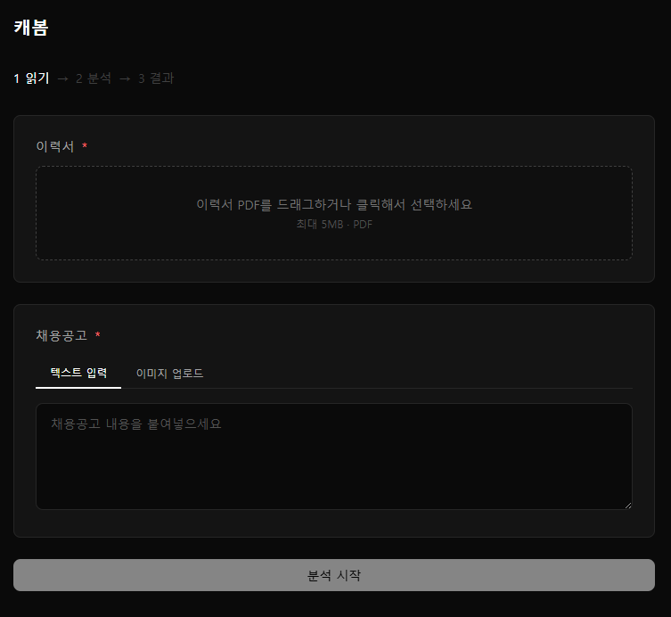
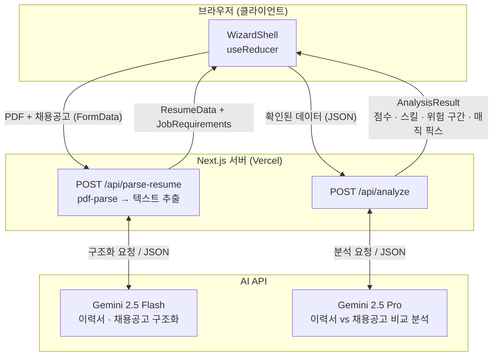

# 캐봄 (Kebom)

탈락 원인을 **캐**고, 합격의 **봄**을 여는 AI 이력서 분석 서비스

> AI가 이력서와 채용공고를 비교 분석해 서류 탈락 원인을 짚어주는 도구

<!-- [서비스 메인 화면 스크린샷 — 다크 테마의 전체 랜딩 페이지] -->

---

## 목차

- [소개](#소개)
- [주요 기능](#주요-기능)
- [데모](#데모)
- [기술 스택](#기술-스택)
- [시작하기](#시작하기)
- [사용 방법](#사용-방법)
- [프로젝트 구조](#프로젝트-구조)
- [아키텍처](#아키텍처)
- [개발 명령어](#개발-명령어)
- [환경 변수](#환경-변수)
- [테스트](#테스트)

---

## 소개

**캐봄**은 취업 준비생이 서류 전형 탈락 원인을 파악할 수 있도록 돕는 AI 분석 도구입니다.

이력서 PDF와 채용공고를 업로드하면, AI가 두 문서를 비교해 다음을 알려줍니다.

- 내 이력서가 채용 요건을 얼마나 충족하는지 (매칭 점수)
- 어떤 스킬이 부족한지 (스킬 히트맵)
- 면접에서 약점이 될 수 있는 항목 (위험 구간)
- 채용공고 키워드에 맞게 이력서를 어떻게 다시 쓸지 (매직 픽스)

마케팅 페이지가 아닌, **실제로 쓰는 분석 도구**를 지향합니다.

---

## 주요 기능

### 1단계 — 업로드



- PDF 이력서 드래그 앤 드롭 또는 파일 선택 (최대 5MB, 텍스트 기반 PDF만 지원)
- 채용공고 텍스트 직접 입력 또는 이미지 업로드

### 2단계 — 이력서 확인

<!-- [Step 2: AI가 추출한 이력서 데이터를 사용자가 확인하고 수정하는 화면] -->

- AI가 이력서에서 이름, 이메일, 스킬, 경력, 학력을 자동 추출
- 추출 결과를 사용자가 직접 수정·확인한 뒤 다음 단계로 진행

### 3단계 — 스킬 분석

<!-- [Step 3: 스킬 히트맵 — 매칭(초록), 부분 매칭(노랑), 미보유(빨강) 배지 화면] -->

- **매칭 점수** (0–100점): 이력서와 채용공고의 전체 일치도
- **스킬 히트맵**: 각 스킬을 세 가지 상태로 분류
  - 🟢 보유 (일치)
  - 🟡 부분 보유 (근접)
  - 🔴 미보유 (누락)

### 4단계 — 액션 플랜

<!-- [Step 4: 위험 구간(면접 약점)과 매직 픽스(이력서 수정 제안) 화면] -->

- **위험 구간**: 면접에서 공격받을 수 있는 최대 5가지 약점과 대응 방법
- **매직 픽스**: 채용공고 키워드에 맞춰 이력서를 개선하는 최대 5가지 제안

---

## 데모

<!-- [전체 사용 흐름 GIF — 업로드 → 확인 → 분석 → 결과까지 30초 내외] -->

<!-- 배포 주소: https://kebom.vercel.app (배포 후 업데이트) -->

---

## 기술 스택

| 영역        | 기술                         |
| ----------- | ---------------------------- |
| 프레임워크  | Next.js 15 (App Router)      |
| 언어        | TypeScript 5.8 (strict mode) |
| 스타일링    | Tailwind CSS v4              |
| AI — 파싱   | Gemini 2.5 Flash             |
| AI — 분석   | Gemini 2.5 Pro               |
| PDF 처리    | pdf-parse (서버 전용)        |
| 레이트 리밋 | Upstash Redis                |
| 테스트      | Jest + React Testing Library |
| 배포        | Vercel                       |

---

## 시작하기

### 사전 요구사항

- Node.js 18.17.0 이상
- Google AI API 키 ([Google AI Studio](https://aistudio.google.com)에서 발급)

### 설치

```bash
# 저장소 클론
git clone https://github.com/your-username/kebom.git
cd kebom

# 의존성 설치
npm install

# 환경 변수 설정
cp .env.example .env.local
# .env.local 파일을 열어 GOOGLE_AI_API_KEY 값을 입력
```

### 실행

```bash
npm run dev
```

브라우저에서 [http://localhost:3000](http://localhost:3000)을 열면 됩니다.

---

## 사용 방법

<!-- [사용 방법 단계별 안내 이미지 — 1~4단계 번호가 표시된 플로우 다이어그램] -->

1. **이력서 업로드** — PDF 파일을 드래그하거나 클릭하여 선택합니다.
2. **채용공고 입력** — 텍스트를 붙여넣거나 채용공고 캡처 이미지를 업로드합니다.
3. **이력서 데이터 확인** — AI가 추출한 내용을 검토하고 필요 시 수정합니다.
4. **분석 결과 확인** — 매칭 점수, 스킬 현황, 면접 위험 구간, 이력서 개선안을 확인합니다.

> **참고**: 로그인이나 회원가입 없이 즉시 사용 가능합니다. 분석 결과는 서버에 저장되지 않습니다.

---

## 프로젝트 구조

```
kebom/
├── src/
│   ├── app/
│   │   ├── page.tsx              # 진입점
│   │   ├── layout.tsx            # 루트 레이아웃
│   │   └── api/
│   │       ├── parse-resume/     # 이력서 파싱 API
│   │       └── analyze/          # 분석 API
│   ├── components/
│   │   ├── wizard/               # 4단계 위자드 컴포넌트
│   │   │   ├── WizardShell.tsx
│   │   │   ├── StepUpload.tsx
│   │   │   ├── StepRead.tsx
│   │   │   ├── StepAnalyze.tsx
│   │   │   └── StepAction.tsx
│   │   └── ui/                   # 재사용 UI 컴포넌트
│   │       ├── SkillBadge.tsx
│   │       ├── FileDropzone.tsx
│   │       ├── EditableField.tsx
│   │       └── ProgressBar.tsx
│   ├── types/                    # TypeScript 타입 정의
│   ├── lib/
│   │   ├── wizardReducer.ts      # 상태 관리
│   │   ├── pdf.ts                # PDF 텍스트 추출
│   │   ├── constants.ts          # 타임아웃, 한도값
│   │   └── ai/                   # AI SDK 로직
│   └── __tests__/                # Jest 테스트
│       ├── api/
│       ├── components/
│       └── lib/
├── docs/                         # 상세 문서
│   ├── PRD.md
│   ├── ARCHITECTURE.md
│   ├── API.md
│   ├── SETUP.md
│   ├── UI_GUIDE.md
│   └── TESTING.md
└── phases/                       # Harness 자동화 단계 정의
```

---

## 아키텍처



**핵심 설계 원칙**

- 모든 AI API 호출은 `app/api/` 라우트에서만 수행 (클라이언트 노출 차단)
- API 키는 서버 환경 변수에서만 읽음 (`NEXT_PUBLIC_` 접두사 금지)
- PDF 및 이력서 데이터는 서버 로그에 기록하지 않음 (개인정보 보호)
- 모든 처리는 메모리 내에서 완료 (임시 파일 디스크 저장 없음)

---

## 개발 명령어

```bash
npm run dev          # 개발 서버 실행 (http://localhost:3000)
npm run build        # 프로덕션 빌드
npm run start        # 프로덕션 서버 실행
npm run lint         # ESLint + TypeScript 타입 검사
npm run test         # Jest 전체 실행
npm run test:watch   # 개발 중 watch 모드
```

---

## 환경 변수

`.env.local` 파일을 루트에 생성하고 아래 값을 입력합니다.

```env
GOOGLE_AI_API_KEY=AIza...
```

| 변수명              | 설명                    | 필수 |
| ------------------- | ----------------------- | ---- |
| `GOOGLE_AI_API_KEY` | Google AI Studio API 키 | ✅   |

> **주의**: `NEXT_PUBLIC_` 접두사를 붙이면 클라이언트 번들에 API 키가 노출됩니다. 절대 사용하지 마세요.

---

## 테스트

```bash
# 전체 테스트 실행
npm run test

# 특정 파일만 실행
npm run test -- src/__tests__/lib/wizardReducer.test.ts

# 커버리지 포함
npm run test -- --coverage
```

테스트는 `src/__tests__/{layer}/` 구조로 관리됩니다.

- `api/` — API 라우트 핸들러 테스트
- `components/` — React 컴포넌트 테스트
- `lib/` — 유틸리티 및 리듀서 테스트

---

## 라이선스

MIT
